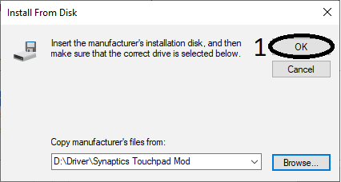

# Synaptic TouchPad Mod

## This is a moded driver for old Synaptic Touchpad. It only work on WINDOWS 10!

### 💾 Installation
* Download the lastest package release and extract it. Then follow all step like this:

## Follow me
* <a href="https://www.facebook.com/kleqing24k/">Facebook</a>
* <a href="https://www.twitter.com/kleqing24k">Twitter</a>